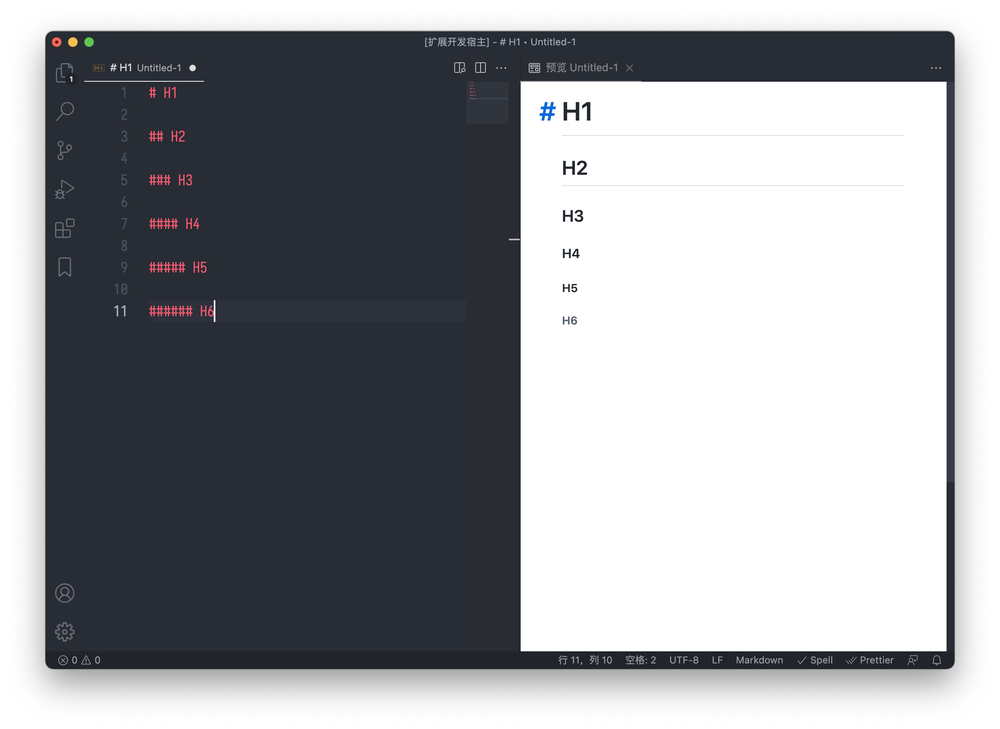

# VS Code Markdown Enhanced

Markdown Enhanced for vscode.

[](https://marketplace.visualstudio.com/items?itemName=tarocch1.markdown-enhanced) [](https://marketplace.visualstudio.com/items?itemName=tarocch1.markdown-enhanced) [](https://marketplace.visualstudio.com/items?itemName=tarocch1.markdown-enhanced)

## Features

### GitHub Preview Theme

Preview supports light and dark themes. Default is light, change theme with setting:

```json
{
  "markdownEnhanced.theme": "dark"
}
```

### [markdown-it-anchor](https://github.com/valeriangalliat/markdown-it-anchor)



## TODO

- Marmaid
- markdown-it plugins
- Export
- Format(?)
